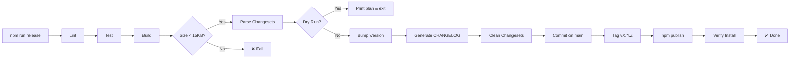

## Table of Contents

1. [Organization & Packages](#1-organization--packages)
2. [npm Registry Setup](#2-npm-registry-setup)
3. [One-Command Release](#3-one-command-release)
4. [Branch Model](#4-branch-model)
5. [Changeset Convention](#5-changeset-convention)
6. [Scripts](#6-scripts)
7. [Release Script](#7-release-script)
8. [CI/CD Workflows](#8-cicd-workflows)
9. [Post-Release Verification](#9-post-release-verification)
10. [Testing Strategy](#10-testing-strategy)
11. [Test Layers](#11-test-layers)
12. [Per-Phase Testing](#12-per-phase-testing)
13. [Edge Case Matrix](#13-edge-case-matrix)
14. [Monkey Testing](#14-monkey-testing)
15. [Reliability Testing](#15-reliability-testing)
16. [Guarantee Verification](#16-guarantee-verification)
17. [Coverage Enforcement](#17-coverage-enforcement)
18. [Rollback Procedures](#18-rollback-procedures)
19. [Version History](#19-version-history)

---

## 1. Organization & Packages

**Organization:** `@better-pwa`

### Package Registry

| Package | Language | npm Name | Bundle Budget | Target Version | Status |
|---------|----------|----------|---------------|----------------|--------|
| Core | TypeScript | `@better-pwa/core` | <15KB gzip | v0.1 | 🟡 Planned |
| Offline | TypeScript | `@better-pwa/offline` | <8KB gzip | v0.3 | 🟡 Planned |
| Storage | TypeScript | `@better-pwa/storage` | <5KB gzip | v0.3 | 🟡 Planned |
| SW Builder | TypeScript | `@better-pwa/sw-builder` | <50KB gzip (output) | v0.1 | 🟡 Planned |
| Manifest | TypeScript | `@better-pwa/manifest` | <3KB gzip | v0.1 | 🟡 Planned |
| CLI | TypeScript | `better-pwa` | N/A (CLI) | v1.0 | 🟡 Planned |
| Adapter React | TypeScript | `@better-pwa/adapter-react` | <2KB gzip | v0.3 | 🟡 Planned |
| Adapter Vue | TypeScript | `@better-pwa/adapter-vue` | <2KB gzip | v0.3 | 🟡 Planned |
| Adapter Svelte | TypeScript | `@better-pwa/adapter-svelte` | <2KB gzip | v0.3 | 🟡 Planned |
| Adapter Next.js | TypeScript | `@better-pwa/adapter-next` | <2KB gzip | v0.3 | 🟡 Planned |
| Adapter Vite | TypeScript | `@better-pwa/adapter-vite` | <2KB gzip | v0.3 | 🟡 Planned |

### Monorepo Structure

```
better-pwa/
├── packages/
│   ├── core/           # @better-pwa/core — State engine, lifecycle, permissions, updates
│   ├── offline/        # @better-pwa/offline — Mutation queue, replay engine, conflict resolution
│   ├── storage/        # @better-pwa/storage — OPFS/IDB/Memory abstraction, quota, eviction
│   ├── sw-builder/     # @better-pwa/sw-builder — Config-driven SW generation
│   ├── manifest/       # @better-pwa/manifest — Manifest generation, icon pipeline
│   ├── cli/            # better-pwa — CLI (doctor, init, build, simulate, audit, debug)
│   ├── adapter-react/  # @better-pwa/adapter-react — React hooks
│   ├── adapter-vue/    # @better-pwa/adapter-vue — Vue composables
│   ├── adapter-svelte/ # @better-pwa/adapter-svelte — Svelte stores
│   ├── adapter-next/   # @better-pwa/adapter-next — Next.js integration
│   └── adapter-vite/   # @better-pwa/adapter-vite — Vite plugin
│
├── examples/
│   ├── saas/
│   ├── ecommerce/
│   └── offline-first/
│
├── docs/               # Documentation site (Eleventy)
├── .github/workflows/  # CI/CD pipelines
├── pnpm-workspace.yaml
└── package.json        # Root workspace config
```

---

## 2. npm Registry Setup

### npm Organization Setup (one-time)

```bash
npm org create @better-pwa
npm org set @better-pwa 0xmilord admin
```

### Package Access

| Package | Access | Reason |
|---------|--------|--------|
| `@better-pwa/core` | Public | Foundation package, maximum adoption |
| `@better-pwa/offline` | Public | Core PWA capability |
| `@better-pwa/storage` | Public | Core PWA capability |
| `@better-pwa/sw-builder` | Public | Build tool, widely needed |
| `@better-pwa/manifest` | Public | Build tool, widely needed |
| `better-pwa` (CLI) | Public | CLI entry point |
| All adapters | Public | Framework integrations |

---

## 3. One-Command Release



```bash
npm run release
```

That's it. Zero human intervention. This single command does everything:

1. **Checkout main** → `git checkout main && git pull origin main`
2. **Lint** → `eslint packages/ --fix` — fails on errors
3. **Test** → `vitest run --coverage` — fails if tests break or coverage <90%
4. **Build** → `pnpm -r run build` — produces ESM, CJS, `.d.ts` for each package — fails if build breaks
5. **Size check** → verifies each package bundle < its budget (core: 15KB, offline: 8KB, storage: 5KB)
6. **Parse changesets** → reads `.changesets/*.md`, determines bump type per package (major > minor > patch)
7. **Bump version** → updates `package.json` for all changed packages
8. **Generate CHANGELOG.md** → aggregates all changeset summaries
9. **Clean changesets** → removes consumed `.changesets/*.md` files
10. **Commit** → `chore: release vX.Y.Z` on main
11. **Tag** → `vX.Y.Z`, push main + tag
12. **Publish** → `pnpm -r publish --access public` (only changed packages)
13. **Verify** → fresh install + smoke test per package
14. **Return to develop** → `git checkout develop`

If any step fails, the pipeline stops. No partial state. Main is untouched until step 10.

### Dry Run

```bash
npm run release:dry-run
```

Prints exactly what would happen (which packages bump, new versions, changesets to delete) without touching git or npm. **Run this before every release.**

---

## 4. Branch Model

```
main                              ← stable, published versions (only touched by release)
  ▲
  │  merge develop + tag + publish
  │
develop                           ← integration branch (all PRs target here)
  ├── feature/*                   ← new features
  ├── fix/*                       ← bug fixes
  └── docs/*                      ← documentation
```

**No one pushes to `main` directly.** Only `npm run release` touches main.

### Daily Flow

**Dev phase:**
```bash
git checkout develop
# code code code
npm run changeset          # interactive: pick patch/minor/major
git add . && git commit -m "feat: add thing"
git push origin develop
```

**Release phase:**
```bash
git checkout main
git merge develop           # fast-forward or --no-ff
npm run release:dry-run     # verify bump type, new version
npm run release             # lint → test → build → commit → tag → publish → done
```

That's the entire loop. No release branches. No git gymnastics.

---

## 5. Changeset Convention

Every PR to `develop` must include a changeset:

```yaml
# .changesets/add-offline-queue.md
---
"@better-pwa/core": minor
"@better-pwa/offline": minor
---

Added offline mutation queue with IDB-backed persistence and replay engine.
```

Types: `major` (breaking), `minor` (feature), `patch` (fix), `none` (docs/chore).

### Multi-Package Changesets

A single changeset can affect multiple packages:

```yaml
---
"@better-pwa/core": minor
"@better-pwa/adapter-react": patch
---

Added `pwa.lifecycle.state()` API and React adapter compatibility.
```

---

## 6. Scripts

### Root `package.json`

```json
{
  "name": "better-pwa-monorepo",
  "private": true,
  "scripts": {
    "lint": "eslint packages/ --fix",
    "test": "vitest run --coverage",
    "test:watch": "vitest watch",
    "test:reliability": "vitest run test/e2e/reliability.test.ts",
    "test:monkey": "vitest run test/e2e/monkey.test.ts",
    "test:guarantees": "vitest run test/e2e/guarantees.test.ts",
    "build": "pnpm -r run build",
    "size": "node scripts/check-sizes.js",
    "changeset": "node scripts/new-changeset.js",
    "release": "node scripts/release.js",
    "release:dry-run": "node scripts/release.js --dry-run"
  },
  "devDependencies": {
    "typescript": "^5.7",
    "vitest": "^3.0",
    "@vitest/coverage-v8": "^3.0",
    "eslint": "^9.0",
    "tsup": "^8.0",
    "jsdom": "^26.0"
  }
}
```

### Per-Package `package.json` (example: `@better-pwa/core`)

```json
{
  "name": "@better-pwa/core",
  "version": "0.1.0",
  "type": "module",
  "main": "./dist/index.cjs",
  "module": "./dist/index.js",
  "types": "./dist/index.d.ts",
  "exports": {
    ".": {
      "import": "./dist/index.js",
      "require": "./dist/index.cjs",
      "types": "./dist/index.d.ts"
    },
    "./testing": {
      "import": "./dist/testing/index.js",
      "require": "./dist-testing/index.cjs",
      "types": "./dist-testing/index.d.ts"
    }
  },
  "scripts": {
    "build": "tsup src/index.ts --format esm,cjs --dts --clean",
    "build:testing": "tsup testing/index.ts --format esm,cjs --dts --out-dir dist-testing --clean"
  },
  "files": ["dist/", "dist-testing/", "package.json", "README.md"]
}
```

### Size Check Script (`scripts/check-sizes.js`)

```js
#!/usr/bin/env node
const { execSync } = require('child_process');
const fs = require('fs');
const path = require('path');

const BUDGETS = {
  '@better-pwa/core': 15360,       // 15KB
  '@better-pwa/offline': 8192,     // 8KB
  '@better-pwa/storage': 5120,     // 5KB
  '@better-pwa/sw-builder': 51200, // 50KB
  '@better-pwa/manifest': 3072,    // 3KB
  '@better-pwa/adapter-react': 2048,
  '@better-pwa/adapter-vue': 2048,
  '@better-pwa/adapter-svelte': 2048,
  '@better-pwa/adapter-next': 2048,
  '@better-pwa/adapter-vite': 2048,
};

let failed = false;

for (const [pkg, budget] of Object.entries(BUDGETS)) {
  const distPath = path.join(__dirname, '..', 'packages', pkg.replace('@better-pwa/', ''), 'dist', 'index.js');
  if (!fs.existsSync(distPath)) {
    console.log(`⏭️  ${pkg}: dist not found (skipped)`);
    continue;
  }
  const content = fs.readFileSync(distPath);
  // Rough gzip estimate: ~30% of raw size
  const gzipped = Math.round(content.length * 0.3);
  const status = gzipped <= budget ? '✅' : '❌';
  if (gzipped > budget) failed = true;
  console.log(`${status} ${pkg}: ${gzipped}B / ${budget}B`);
}

if (failed) {
  console.error('\n❌ Bundle size budget exceeded');
  process.exit(1);
}
console.log('\n✅ All packages within size budget');
```

### `npm run changeset` — Interactive Helper

```
What changed?
  [1] patch  — bug fix, no API change
  [2] minor  — new feature, backward compatible
  [3] major  — breaking change

Type a number: 2

Affected packages (space-separated, or ENTER for all):
  [1] @better-pwa/core
  [2] @better-pwa/offline
  [3] @better-pwa/storage
  [4] @better-pwa/sw-builder
  [5] @better-pwa/manifest
  [6] better-pwa (CLI)
  [7] adapter-react
  [8] adapter-vue
  [9] adapter-svelte

Select: 1

Summary: Added pwa.update.setStrategy() with soft/hard/gradual/on-reload support
File: .changesets/2026-04-04-update-strategies.md ✓
```

---

## 7. Release Script

```js
#!/usr/bin/env node
// scripts/release.js

const { execSync } = require('child_process');
const fs = require('fs');
const path = require('path');

const CHANGES_DIR = path.join(__dirname, '..', '.changesets');
const PACKAGES_DIR = path.join(__dirname, '..', 'packages');
const DRY_RUN = process.argv.includes('--dry-run');

const BUDGETS = {
  '@better-pwa/core': 15360,
  '@better-pwa/offline': 8192,
  '@better-pwa/storage': 5120,
  '@better-pwa/sw-builder': 51200,
  '@better-pwa/manifest': 3072,
  '@better-pwa/adapter-react': 2048,
  '@better-pwa/adapter-vue': 2048,
  '@better-pwa/adapter-svelte': 2048,
  '@better-pwa/adapter-next': 2048,
  '@better-pwa/adapter-vite': 2048,
};

function run(cmd, cwd) {
  console.log(`> ${cmd}`);
  if (DRY_RUN) return '';
  return execSync(cmd, { stdio: 'pipe', cwd: cwd || process.cwd() }).toString().trim();
}

function getPackageDirs() {
  return fs.readdirSync(PACKAGES_DIR).filter(f =>
    fs.statSync(path.join(PACKAGES_DIR, f)).isDirectory()
  );
}

function readPackageJson(dir) {
  return JSON.parse(fs.readFileSync(path.join(PACKAGES_DIR, dir, 'package.json'), 'utf-8'));
}

function writePackageJson(dir, pkg) {
  fs.writeFileSync(
    path.join(PACKAGES_DIR, dir, 'package.json'),
    JSON.stringify(pkg, null, 2) + '\n'
  );
}

function parseChangesets() {
  if (!fs.existsSync(CHANGES_DIR)) return { packages: {} };

  const files = fs.readdirSync(CHANGES_DIR).filter(f => f.endsWith('.md'));
  if (files.length === 0) return { packages: {} };

  const packages = {};

  for (const file of files) {
    const content = fs.readFileSync(path.join(CHANGES_DIR, file), 'utf-8');
    const lines = content.split('\n');
    const frontmatter = [];
    let inFrontmatter = false;

    for (const line of lines) {
      if (line === '---') { inFrontmatter = !inFrontmatter; continue; }
      if (inFrontmatter) frontmatter.push(line);
    }

    for (const fmLine of frontmatter) {
      const [pkgName, bumpType] = fmLine.split(':').map(s => s.replace(/["']/g, '').trim());
      if (pkgName && bumpType) {
        if (!packages[pkgName]) packages[pkgName] = { bump: 'patch', entries: [] };
        if (bumpType === 'major') packages[pkgName].bump = 'major';
        else if (bumpType === 'minor' && packages[pkgName].bump !== 'major') packages[pkgName].bump = 'minor';

        const summary = lines.slice(lines.indexOf('---', lines.indexOf('---') + 1) + 1).join('\n').trim();
        packages[pkgName].entries.push({ file, summary });
      }
    }
  }

  return { packages };
}

function bumpVersion(current, bump) {
  const [major, minor, patch] = current.split('.').map(Number);
  switch (bump) {
    case 'major': return `${major + 1}.0.0`;
    case 'minor': return `${major}.${minor + 1}.0`;
    case 'patch': return `${major}.${minor}.${patch + 1}`;
    default: return current;
  }
}

async function main() {
  console.log(`\n🚀 better-pwa release${DRY_RUN ? ' (dry run)' : ''}\n`);

  // Step 0: Checkout main
  if (!DRY_RUN) {
    console.log('[0/11] Switching to main...');
    run('git checkout main');
    run('git pull origin main');
  }

  // Step 1: Lint
  console.log('[1/11] Linting...');
  run('npm run lint');

  // Step 2: Test
  console.log('[2/11] Running tests...');
  run('npm run test');

  // Step 3: Build
  console.log('[3/11] Building all packages...');
  run('npm run build');

  // Step 4: Size check
  console.log('[4/11] Checking bundle sizes...');
  try {
    run('node scripts/check-sizes.js');
  } catch (e) {
    console.error(e.stdout.toString());
    if (!DRY_RUN) run('git checkout develop');
    process.exit(1);
  }

  // Step 5: Parse changesets
  console.log('[5/11] Parsing changesets...');
  const { packages } = parseChangesets();
  if (Object.keys(packages).length === 0) {
    console.log('⚠️  No changesets found. Nothing to release.');
    if (!DRY_RUN) run('git checkout develop');
    process.exit(0);
  }

  const bumpPlan = {};
  for (const [pkgName, info] of Object.entries(packages)) {
    const dir = pkgName.replace('@better-pwa/', '').replace('better-pwa', 'cli');
    const pkgPath = path.join(PACKAGES_DIR, dir, 'package.json');
    if (!fs.existsSync(pkgPath)) continue;
    const pkg = JSON.parse(fs.readFileSync(pkgPath, 'utf-8'));
    const newVersion = bumpVersion(pkg.version, info.bump);
    bumpPlan[pkgName] = { dir, oldVersion: pkg.version, newVersion, bump: info.bump, entries: info.entries };
    console.log(`  ${pkgName}: ${pkg.version} → ${newVersion} (${info.bump})`);
  }

  if (DRY_RUN) {
    console.log('\n[dry-run] Would execute:');
    for (const [pkgName, plan] of Object.entries(bumpPlan)) {
      console.log(`  - Update ${pkgName} to ${plan.newVersion}`);
      console.log(`  - Delete ${plan.entries.length} changeset(s)`);
    }
    console.log('  - Commit on main, tag, push');
    console.log('  - npm publish (changed packages only)');
    console.log('\n✅ Dry run complete. Run without --dry-run to release.');
    process.exit(0);
  }

  // Step 6: Update package.json files + generate CHANGELOG
  console.log('[6/11] Updating versions...');
  const date = new Date().toISOString().split('T')[0];
  const changelogEntries = [];

  for (const [pkgName, plan] of Object.entries(bumpPlan)) {
    const pkgPath = path.join(PACKAGES_DIR, plan.dir, 'package.json');
    const pkg = JSON.parse(fs.readFileSync(pkgPath, 'utf-8'));
    pkg.version = plan.newVersion;
    fs.writeFileSync(pkgPath, JSON.stringify(pkg, null, 2) + '\n');

    changelogEntries.push(`## ${pkgName}@${plan.newVersion} (${date})\n`);
    for (const entry of plan.entries) {
      changelogEntries.push(`- ${entry.summary}`);
    }
    changelogEntries.push('');

    for (const entry of plan.entries) {
      fs.unlinkSync(path.join(CHANGES_DIR, entry.file));
    }
  }

  // Update root CHANGELOG.md
  const changelogPath = path.join(__dirname, '..', 'CHANGELOG.md');
  const existing = fs.existsSync(changelogPath) ? fs.readFileSync(changelogPath, 'utf-8') : '# Changelog\n\n';
  const newChangelog = existing.replace('# Changelog\n', `# Changelog\n\n${changelogEntries.join('\n')}`);
  fs.writeFileSync(changelogPath, newChangelog);

  // Step 7: Commit on main
  console.log('[7/11] Committing on main...');
  run('git add .');
  const versionStr = Object.values(bumpPlan).map(p => `${Object.keys(bumpPlan).find(k => bumpPlan[k] === p)}@${p.newVersion}`).join(', ');
  run(`git commit -m "chore: release ${versionStr}"`);

  // Step 8: Tag + push
  const firstVersion = Object.values(bumpPlan)[0].newVersion;
  console.log('[8/11] Tagging and pushing...');
  run(`git tag v${firstVersion}`);
  run('git push origin main');
  run(`git push origin v${firstVersion}`);

  // Step 9: Publish changed packages
  console.log('[9/11] Publishing to npm...');
  for (const [pkgName, plan] of Object.entries(bumpPlan)) {
    const pkgDir = path.join(PACKAGES_DIR, plan.dir);
    run('npm publish --access public', pkgDir);
    console.log(`✅ Published ${pkgName}@${plan.newVersion}`);
  }

  // Step 10: Post-release verification
  console.log('[10/11] Verifying installs...');
  for (const [pkgName] of Object.entries(bumpPlan)) {
    console.log(`  Verifying ${pkgName}...`);
    run(`cd /tmp && mkdir _verify_${Date.now()} && cd _verify_${Date.now()} && npm init -y && npm install ${pkgName} && cd / && rm -rf /tmp/_verify_*`);
  }

  // Step 11: Return to develop
  console.log('[11/11] Returning to develop...');
  run('git checkout develop');
  console.log(`\n✅ Release complete. Published ${Object.keys(bumpPlan).length} package(s).`);
}

main().catch(err => {
  console.error('\n❌ Release failed:', err.message);
  try { run('git checkout develop'); } catch (_) {}
  process.exit(1);
});
```

---

## 8. CI/CD Workflows

### `.github/workflows/ci.yml` — On Every Push/PR

```yaml
name: CI

on:
  push:
    branches: [develop, main]
  pull_request:
    branches: [develop]

jobs:
  check:
    runs-on: ubuntu-latest
    steps:
      - uses: actions/checkout@v4

      - uses: pnpm/action-setup@v4
        with:
          version: 9

      - uses: actions/setup-node@v4
        with:
          node-version: 22
          cache: 'pnpm'

      - name: Install dependencies
        run: pnpm install --frozen-lockfile

      - name: Lint
        run: pnpm lint

      - name: Test
        run: pnpm test

      - name: Build
        run: pnpm build

      - name: Verify bundle sizes
        run: pnpm size

      - name: Guarantee verification
        run: pnpm test:guarantees

      - name: Reliability testing
        run: pnpm test:reliability
```

### `.github/workflows/release.yml` — On Tag Push

```yaml
name: Release

on:
  push:
    tags: ['v*']

jobs:
  verify-and-publish:
    runs-on: ubuntu-latest
    steps:
      - uses: actions/checkout@v4

      - uses: pnpm/action-setup@v4
        with:
          version: 9

      - uses: actions/setup-node@v4
        with:
          node-version: 22
          registry-url: 'https://registry.npmjs.org'
          cache: 'pnpm'

      - name: Install dependencies
        run: pnpm install --frozen-lockfile

      - name: Build all packages
        run: pnpm build

      - name: Final size check
        run: pnpm size

      - name: Final test pass
        run: pnpm test

      - name: Publish changed packages
        run: |
          for pkg in packages/*/; do
            if [ -f "$pkg/package.json" ]; then
              cd "$pkg"
              npm publish --access public || true
              cd ../..
            fi
          done
        env:
          NODE_AUTH_TOKEN: ${{ secrets.NPM_TOKEN }}
```

### `.github/workflows/deploy-docs.yml` — Docs Deploy

*(Already exists — see existing file)*

---

## 9. Post-Release Verification (Automated)

After every publish, verification runs in a clean environment:

```bash
# Core package verification
cd /tmp && mkdir _verify && cd _verify
npm init -y
npm install @better-pwa/core
node -e "
  const { createPwa } = require('@better-pwa/core');
  // Verify createPwa exists and returns a runtime object
  const pwa = createPwa({ preset: 'saas' });
  console.assert(typeof pwa.state === 'function', 'pwa.state should be a function');
  console.assert(typeof pwa.update === 'object', 'pwa.update should exist');
  console.assert(typeof pwa.permissions === 'object', 'pwa.permissions should exist');
  console.log('✅ @better-pwa/core verification passed');
"
cd / && rm -rf /tmp/_verify
```

If this fails, the release is flagged and the tag is removed automatically.

---

## 10. Testing Strategy

> **Target: 90% coverage across all metrics — statements, branches, functions, lines.**
> 100% is a vanity metric. 90% is enterprise-realistic.

### Principles

| Principle | Enforcement |
|-----------|-------------|
| **90% minimum coverage** | Every metric: statements, branches, functions, lines |
| **No mock-only tests** | Real objects, real behavior. Browser APIs mocked via jsdom, not spied |
| **Every branch both ways** | `if` tested true AND false, ternary both paths |
| **Edge cases first** | null, undefined, empty, max, min, circular, concurrent |
| **Monkey testing** | Random inputs, unexpected types, abuse patterns |
| **Reliability testing** | 10,000 iterations, no crashes, no memory leaks |
| **Three test layers** | Unit → Integration → End-to-End |
| **Tests alongside code** | Every source file has a co-located test file |
| **No `any` in tests** | Type-safe tests only |
| **Deterministic** | No flaky tests, no timing dependencies (except explicit timing tests) |
| **Guarantee tests** | Every guarantee in GUARANTEES.md has a corresponding E2E test |

### Test Environment

```typescript
// vitest.config.ts
import { defineConfig } from 'vitest/config';

export default defineConfig({
  test: {
    globals: true,
    environment: 'jsdom',
    coverage: {
      provider: 'v8',
      reporter: ['text', 'json', 'lcov'],
      thresholds: {
        statements: 90,
        branches: 90,
        functions: 90,
        lines: 90,
      },
    },
    // Service Worker testing via mocked navigator.serviceWorker
    // BroadcastChannel testing via jsdom-polyfill or manual mock
    // IndexedDB testing via fake-indexeddb
  },
});
```

### Testing Dependencies

```json
{
  "devDependencies": {
    "vitest": "^3.0",
    "@vitest/coverage-v8": "^3.0",
    "jsdom": "^26.0",
    "fake-indexeddb": "^6.0",
    "broadcastchannel-polyfill": "^1.0"
  }
}
```

---

## 11. Test Layers

### Layer 1: Unit Tests

**Scope**: Individual modules in isolation.

**Location**: `packages/{name}/test/`

**Rule**: Every source file in `src/` has a corresponding test file.

#### @better-pwa/core

| Source File | Test File | Type |
|-------------|-----------|------|
| `src/state/engine.ts` | `test/state/engine.test.ts` | Unit |
| `src/state/store.ts` | `test/state/store.test.ts` | Unit |
| `src/state/subscriber.ts` | `test/state/subscriber.test.ts` | Unit |
| `src/lifecycle/bus.ts` | `test/lifecycle/bus.test.ts` | Unit |
| `src/lifecycle/register.ts` | `test/lifecycle/register.test.ts` | Unit |
| `src/updates/controller.ts` | `test/updates/controller.test.ts` | Unit |
| `src/updates/strategies.ts` | `test/updates/strategies.test.ts` | Unit |
| `src/permissions/orchestrator.ts` | `test/permissions/orchestrator.test.ts` | Unit |
| `src/permissions/fallback.ts` | `test/permissions/fallback.test.ts` | Unit |
| `src/presets/index.ts` | `test/presets/index.test.ts` | Unit |
| `src/presets/saas.ts` | `test/presets/saas.test.ts` | Unit |
| `src/presets/ecommerce.ts` | `test/presets/ecommerce.test.ts` | Unit |
| `src/presets/offline-first.ts` | `test/presets/offline-first.test.ts` | Unit |
| `src/presets/content.ts` | `test/presets/content.test.ts` | Unit |
| `src/boot/stages.ts` | `test/boot/stages.test.ts` | Unit |
| `src/boot/freshness.ts` | `test/boot/freshness.test.ts` | Unit |
| `src/migrations/registry.ts` | `test/migrations/registry.test.ts` | Unit |
| `src/migrations/executor.ts` | `test/migrations/executor.test.ts` | Unit |
| `src/priority/queue.ts` | `test/priority/queue.test.ts` | Unit |
| `src/capabilities/detect.ts` | `test/capabilities/detect.test.ts` | Unit |
| `src/index.ts` | `test/index.test.ts` | Unit |

#### @better-pwa/offline

| Source File | Test File | Type |
|-------------|-----------|------|
| `src/queue/manager.ts` | `test/queue/manager.test.ts` | Unit |
| `src/queue/entry.ts` | `test/queue/entry.test.ts` | Unit |
| `src/replay/engine.ts` | `test/replay/engine.test.ts` | Unit |
| `src/replay/scheduler.ts` | `test/replay/scheduler.test.ts` | Unit |
| `src/conflict/lww.ts` | `test/conflict/lww.test.ts` | Unit |
| `src/conflict/merge.ts` | `test/conflict/merge.test.ts` | Unit |
| `src/conflict/manual.ts` | `test/conflict/manual.test.ts` | Unit |
| `src/conflict/registry.ts` | `test/conflict/registry.test.ts` | Unit |
| `src/conflict/crdt.ts` | `test/conflict/crdt.test.ts` | Unit |
| `src/index.ts` | `test/index.test.ts` | Unit |

#### @better-pwa/storage

| Source File | Test File | Type |
|-------------|-----------|------|
| `src/engines/opfs.ts` | `test/engines/opfs.test.ts` | Unit |
| `src/engines/idb.ts` | `test/engines/idb.test.ts` | Unit |
| `src/engines/memory.ts` | `test/engines/memory.test.ts` | Unit |
| `src/engines/selector.ts` | `test/engines/selector.test.ts` | Unit |
| `src/quota/monitor.ts` | `test/quota/monitor.test.ts` | Unit |
| `src/eviction/lru.ts` | `test/eviction/lru.test.ts` | Unit |
| `src/eviction/lfu.ts` | `test/eviction/lfu.test.ts` | Unit |
| `src/eviction/ttl.ts` | `test/eviction/ttl.test.ts` | Unit |
| `src/index.ts` | `test/index.test.ts` | Unit |

#### @better-pwa/sw-builder

| Source File | Test File | Type |
|-------------|-----------|------|
| `src/builder/index.ts` | `test/builder/index.test.ts` | Unit |
| `src/builder/esbuild.ts` | `test/builder/esbuild.test.ts` | Unit |
| `src/precache/config.ts` | `test/precache/config.test.ts` | Unit |
| `src/strategies/index.ts` | `test/strategies/index.test.ts` | Unit |
| `src/index.ts` | `test/index.test.ts` | Unit |

#### @better-pwa/manifest

| Source File | Test File | Type |
|-------------|-----------|------|
| `src/generator/index.ts` | `test/generator/index.test.ts` | Unit |
| `src/icons/resizer.ts` | `test/icons/resizer.test.ts` | Unit |
| `src/index.ts` | `test/index.test.ts` | Unit |

#### better-pwa (CLI)

| Source File | Test File | Type |
|-------------|-----------|------|
| `src/commands/init.ts` | `test/commands/init.test.ts` | Unit |
| `src/commands/build.ts` | `test/commands/build.test.ts` | Unit |
| `src/commands/doctor.ts` | `test/commands/doctor.test.ts` | Unit |
| `src/commands/preview.ts` | `test/commands/preview.test.ts` | Unit |
| `src/commands/simulate.ts` | `test/commands/simulate.test.ts` | Unit |
| `src/commands/audit.ts` | `test/commands/audit.test.ts` | Unit |
| `src/commands/debug.ts` | `test/commands/debug.test.ts` | Unit |
| `src/index.ts` | `test/index.test.ts` | Unit |

### Layer 2: Integration Tests

**Scope**: Cross-module interactions, full lifecycle, multi-tab, SW communication.

**Location**: `packages/core/test/integration/`

| Test File | What It Tests |
|-----------|--------------|
| `test/integration/boot-sequence.test.ts` | Full staged boot: hydrate → sync → update → replay |
| `test/integration/state-machine.test.ts` | All lifecycle state transitions with guards |
| `test/integration/state-sync.test.ts` | State propagation across tabs via BroadcastChannel |
| `test/integration/leader-election.test.ts` | Leader election, re-election, no duplicate replays |
| `test/integration/update-lifecycle.test.ts` | SW update: detect → wait → activate → reload |
| `test/integration/update-rollback.test.ts` | Failed activation rolls back to previous SW |
| `test/integration/permission-flow.test.ts` | Batch request → deny → fallback → retry → grant |
| `test/integration/offline-replay.test.ts` | Enqueue offline → reconnect → replay → confirm |
| `test/integration/priority-replay.test.ts` | Critical mutations replay before low-priority |
| `test/integration/storage-fallback.test.ts` | OPFS → IDB → Memory cascade when unavailable |
| `test/integration/quota-eviction.test.ts` | Storage fills → LRU eviction triggers correctly |
| `test/integration/migration-chain.test.ts` | v1 → v2 → v3 migration executes atomically |
| `test/integration/cold-start.test.ts` | 3 days offline → stale cache → deterministic boot |
| `test/integration/plugin-isolation.test.ts` | Plugin errors don't crash runtime |
| `test/integration/sw-communication.test.ts` | Main thread ↔ SW postMessage flow |
| `test/integration/preset-overrides.test.ts` | Preset defaults overridden by custom config |

### Layer 3: End-to-End Tests

**Scope**: Real-world scenarios, public API surface, guarantee verification.

**Location**: `packages/core/test/e2e/`

| Test File | What It Tests |
|-----------|--------------|
| `test/e2e/public-api.test.ts` | All exports from `@better-pwa/core` work correctly |
| `test/e2e/esm-cjs.test.ts` | Dual module (ESM + CJS) load and produce identical results |
| `test/e2e/saas-preset.test.ts` | Full saas app lifecycle: boot → online → offline → sync → update |
| `test/e2e/ecommerce-preset.test.ts` | Cart persistence, checkout flow, offline order queue |
| `test/e2e/offline-first-preset.test.ts` | Heavy offline usage, large mutation queue, reliable replay |
| `test/e2e/multi-tab-coordination.test.ts` | 5 tabs open, state sync, leader election, no duplicate replays |
| `test/e2e/guarantees.test.ts` | All 9 guarantees from GUARANTEES.md verified |
| `test/e2e/reliability.test.ts` | 10,000 iterations, no crashes, no memory leaks |
| `test/e2e/monkey.test.ts` | Random inputs, abuse patterns, unexpected types |
| `test/e2e/edge-cases.test.ts` | Boundary values, extreme inputs, concurrent operations |
| `test/e2e/cold-start-scenarios.test.ts` | Various offline durations, stale caches, pending updates |
| `test/e2e/update-scenarios.test.ts` | Soft, hard, gradual, on-reload strategies in multi-tab |
| `test/e2e/permission-scenarios.test.ts` | Batch, deny, retry, grant, cross-tab sync |
| `test/e2e/storage-scenarios.test.ts` | Engine selection, quota pressure, eviction correctness |
| `test/e2e/migration-scenarios.test.ts` | Old state + new schema → migration → correct data |

---

## 12. Per-Phase Testing Requirements

### Phase 1 (v0.1) — Core + State Engine + SW Builder

| Category | Tests Required |
|----------|---------------|
| State engine | Instantiation, subscribe/unsubscribe, snapshot immutability, IDB persistence, cross-tab sync |
| Lifecycle bus | Register events, emit, subscribe, unsubscribe, error handling |
| SW builder | esbuild integration, Workbox precaching, config validation, output correctness |
| Manifest engine | JSON generation, icon resizing, 2026 fields |
| Presets | All 4 presets produce correct config, override API works |
| Cold start | Staged boot, per-stage timeout, failure isolation, cache freshness |
| Bundle size | Core <15KB gzip, sw-builder output <50KB gzip |

### Phase 2 (v0.2) — Update UX + Permissions + Simulator

| Category | Tests Required |
|----------|---------------|
| Update controller | All 4 strategies, state machine transitions, rollback on failure, loop detection |
| Permission orchestrator | Batch requests, deduplication, retry backoff, fallback UI, state invalidation |
| Deterministic state machine | All 8 states, all transitions, guard conditions, fallback states |
| State migrations | Registry, auto-chaining, atomicity, rollback, migration gate |
| Dev-time simulator | CLI commands, programmatic API, tree-shaking, DevTools panel |

### Phase 3 (v0.3) — Offline Data + Storage

| Category | Tests Required |
|----------|---------------|
| Mutation queue | IDB persistence, FIFO ordering, enqueue/dequeue, crash durability |
| Replay engine | Online trigger, parallel execution, backoff on failure, at-least-once delivery |
| Conflict resolution | LWW, merge, manual, custom registry, CRDT, wildcard patterns |
| Storage abstraction | OPFS/IDB/Memory engines, auto-selection, CRUD operations, key patterns |
| Quota & eviction | Monitoring, threshold triggers, LRU/LFU/TTL correctness |
| Framework adapters | React hooks, Vue composables, Svelte stores, SSR safety, tree-shaking |
| Priority system | Replay ordering, cache eviction, sync scheduling, preset mappings |

### Phase 4 (v0.4) — Multi-Tab + Observability + Plugins

| Category | Tests Required |
|----------|---------------|
| Multi-tab sync | Leader election (<100ms), state propagation (<50ms), deduplication, re-election |
| Observability | Event bus, metrics emission, telemetry adapters, async flush |
| Plugin system | Registration, lifecycle hooks, API extension, error isolation, runtime disable |
| Capability confidence | Scoring accuracy, browser issue database, dynamic updates |

### Phase 5 (v1.0) — Production + Guarantees + CLI

| Category | Tests Required |
|----------|---------------|
| Security | CSP presets, permission policies, scope isolation |
| Distribution | Doctor CLI correctness, Lighthouse integration |
| Push & sync | Notification delivery, background sync, periodic sync |
| Growth engine | Install optimization, A/B testing, analytics hooks |
| All guarantees | Each of 9 guarantees has dedicated E2E test (see §16) |
| CLI completeness | All 7 commands work correctly, error messages are actionable |

### Phase 6 (v1.1) — Enterprise Control Layer

| Category | Tests Required |
|----------|---------------|
| Auth guard | Token persistence, cross-tab refresh, offline queueing, 401 storm prevention |
| Network intelligence | Profiling accuracy, adaptive sync behavior, retry policy selection |
| Audit system | Auto-logging, tamper detection (hash chain), export correctness, retention |
| Policy engine | Rule enforcement, violation logging, remote fetch, MDM compatibility |
| Feature flags | Remote polling, percentage activation, update integration |
| Disaster recovery | Reset with preservation, integrity check, queue overflow, rollback |
| SLA metrics | Accuracy (±1%), export format compatibility, alerting thresholds |
| Capability matrix | Browser coverage completeness, degradation mapping |

---

## 13. Edge Case Matrix

Every function is tested with these input categories:

| Category | Inputs |
|----------|--------|
| **Null/Undefined** | `null`, `undefined`, `void 0` |
| **Empty** | `""`, `[]`, `{}`, `0` |
| **Boundary** | `0`, `-1`, `Number.MAX_SAFE_INTEGER`, `Infinity`, `NaN` |
| **Type mismatches** | string where number expected, object where primitive expected |
| **Circular refs** | Self-reference, mutual reference, deep circular |
| **Deep nesting** | 10+ levels, exceeds maxDepth |
| **Large inputs** | 10KB string, 1000-entry queue, 100-tab scenario |
| **Concurrent** | 10 simultaneous tabs, interleaved state changes |
| **Post-completion** | All methods called after boot completes |
| **Double calls** | `activate()` then `activate()`, `replay()` then `replay()` |
| **Error types** | `Error`, `TypeError`, string, number, null, undefined, object, Symbol, Function, Promise, Date, RegExp |
| **Network transitions** | online→offline→online in rapid succession (10ms intervals) |
| **Tab lifecycle** | Tab crashes without `beforeunload`, force-close, browser kill |
| **SW failures** | SW registration fails, SW script 404, SW syntax error |
| **IDB failures** | Quota exceeded, browser clears IDB, IDB version conflict |

---

## 14. Monkey Testing

| Test | Iterations | What |
|------|-----------|------|
| `createPwa` abuse | 10,000 | Random presets, random overrides, no crashes |
| `pwa.state().set()` abuse | 10,000 | Random keys, random values (including circular), no crashes |
| `pwa.state().subscribe()` abuse | 10,000 | Subscribe/unsubscribe in tight loop, no leaks |
| `pwa.permissions.request()` abuse | 10,000 | Random permission names, mixed types, always returns Promise |
| `pwa.offline.enqueue()` abuse | 10,000 | Random payloads, circular objects, large data, no crashes |
| `pwa.storage.set()` abuse | 10,000 | Random engines, random values, key collisions, no crashes |
| Concurrent state changes | 100 tabs × 100 changes | No race conditions, consistent final state |
| Rapid boot/reboot | 1,000 cycles | Create PWA → boot → destroy → create again, no leaks |
| Post-completion abuse | 1,000 flows | Call every method after boot, all handled gracefully |
| Mutation queue overflow | 10,000 entries | Queue caps correctly, oldest entries handled |

---

## 15. Reliability Testing

| Metric | Test | Pass Criteria |
|--------|------|--------------|
| **Memory** | Create 10,000 PWAs, boot all, destroy all, no growth | GC cleans all traces |
| **No leaks** | Subscribe 1,000 listeners, unsubscribe all, complete boot | `_subscribers.size === 0` |
| **Stability** | 10,000 createPwa → boot → state changes → destroy cycles | Zero errors, zero crashes |
| **Consistency** | Same preset created 100 times produces same structure | IDs differ, everything else identical |
| **Thread safety** | 10 concurrent tabs with shared state | No race conditions, no corrupted state |
| **BroadcastChannel** | 50 tabs exchanging state simultaneously | No message loss, no duplication |
| **IDB durability** | 10,000 write/read cycles to IDB | All operations succeed, no corruption |
| **Queue integrity** | Enqueue 1,000 mutations, replay all, verify delivery | All 1,000 delivered in order |

---

## 16. Guarantee Verification

Every guarantee in GUARANTEES.md has a corresponding E2E test:

| Guarantee | Test File | What It Verifies |
|-----------|-----------|-----------------|
| G1: Data Durability | `test/e2e/guarantees/data-durability.test.ts` | Mutation survives crash, replay delivers, no drops |
| G2: Update Safety | `test/e2e/guarantees/update-safety.test.ts` | No session interruption, no loops, rollback on failure |
| G3: Cross-Tab Consistency | `test/e2e/guarantees/cross-tab.test.ts` | State propagation <50ms, no duplicates, accurate tab count |
| G4: Permission Resilience | `test/e2e/guarantees/permission.test.ts` | No silent denials, batch dedup, retry backoff, cross-tab sync |
| G5: Cold Start Integrity | `test/e2e/guarantees/cold-start.test.ts` | Deterministic boot, no race conditions, graceful degradation |
| G6: Schema Evolution | `test/e2e/guarantees/migration.test.ts` | No unmigrated reads, atomic migration, rollback on failure |
| G7: Resource Prioritization | `test/e2e/guarantees/priority.test.ts` | Critical replays first, low evicted first, critical synced first |
| G8: Auth Session Continuity | `test/e2e/guarantees/auth-continuity.test.ts` | No 401 storms, cross-tab refresh, token persistence |
| G9: Audit Completeness | `test/e2e/guarantees/audit-completeness.test.ts` | All events logged, tamper detection, export correctness |

### Guarantee Test Pattern

Each guarantee test follows this structure:

```typescript
describe('Guarantee G1: Data Durability', () => {
  it('survives browser crash and delivers mutation after reconnect', async () => {
    // Arrange: Create PWA, enqueue mutation
    const pwa = createPwa({ preset: 'saas' });
    await simulate.offline(pwa);
    pwa.offline.enqueue({ type: 'create', resource: '/api/orders', payload: order });

    // Act: Simulate crash (clear memory state, preserve IDB)
    await simulate.crash(pwa, { preserve: ['idb'] });

    // Reboot
    const pwa2 = createPwa({ preset: 'saas' });
    await simulate.online(pwa2);
    await pwa2.offline.flush();

    // Assert: Mutation was delivered
    expect(server.receivedOrders).toContainEqual(order);
    expect(await pwa2.offline.queueDepth()).toBe(0);
  });

  it('emits mutation:failed event after max retries', async () => {
    // ...
  });

  it('preserves FIFO order for same-resource mutations', async () => {
    // ...
  });
});
```

---

## 17. Coverage Enforcement

### CI Thresholds (`vitest.config.ts`)

```typescript
coverage: {
  thresholds: {
    statements: 90,
    branches: 90,
    functions: 90,
    lines: 90,
  },
},
```

### Local Development

```bash
npm run test          # runs with 90% threshold
npm run test:watch    # watch mode, no threshold enforcement
npm run test:reliability  # 10K iteration tests
npm run test:monkey     # abuse pattern tests
npm run test:guarantees # guarantee verification tests
```

### No Exclusions

- No `/* istanbul ignore */` comments
- No `coverage.exclude` in vitest config
- No `// @ts-ignore` in test files
- No `any` casts to bypass type safety
- No empty test blocks (ESLint rule)

---

## 18. Rollback Procedures

### Emergency Rollback (Within 72h of Publish)

```bash
# Unpublish the bad version (permanent removal from npm)
npm unpublish @better-pwa/core@X.Y.Z --force

# Or deprecate (visible on npm, recommends alternative)
npm deprecate @better-pwa/core@X.Y.Z "Critical bug. Use X.Y.(Z-1) instead."

# Remove git tag
git tag -d vX.Y.Z && git push origin :refs/tags/vX.Y.Z

# Revert the release commit on main
git revert HEAD --no-edit
git push origin main
```

### Multi-Package Rollback

If multiple packages were published with a bad release:

```bash
for pkg in @better-pwa/core @better-pwa/offline @better-pwa/storage; do
  npm deprecate ${pkg}@X.Y.Z "Bad release. Use previous version."
done
```

### Automatic Rollback (CI)

If post-release verification fails:

```yaml
# In release.yml, after verification step:
- name: Rollback on verification failure
  if: failure()
  run: |
    npm unpublish @better-pwa/core@${VERSION} --force
    git tag -d v${VERSION}
    git push origin :refs/tags/v${VERSION}
    git revert HEAD --no-edit
    git push origin main
```

---

## 19. Version History

| Package | Version | Date | Changes |
|---------|---------|------|---------|
| `@better-pwa/core` | `0.1.0` | TBD | Initial release: state engine, lifecycle, presets, cold start |
| `@better-pwa/sw-builder` | `0.1.0` | TBD | Initial release: SW generation, Workbox integration |
| `@better-pwa/manifest` | `0.1.0` | TBD | Initial release: manifest generation, icon pipeline |

---

*Document Version: 1.0 | Last Updated: 2026-04-04 | Status: Active*
